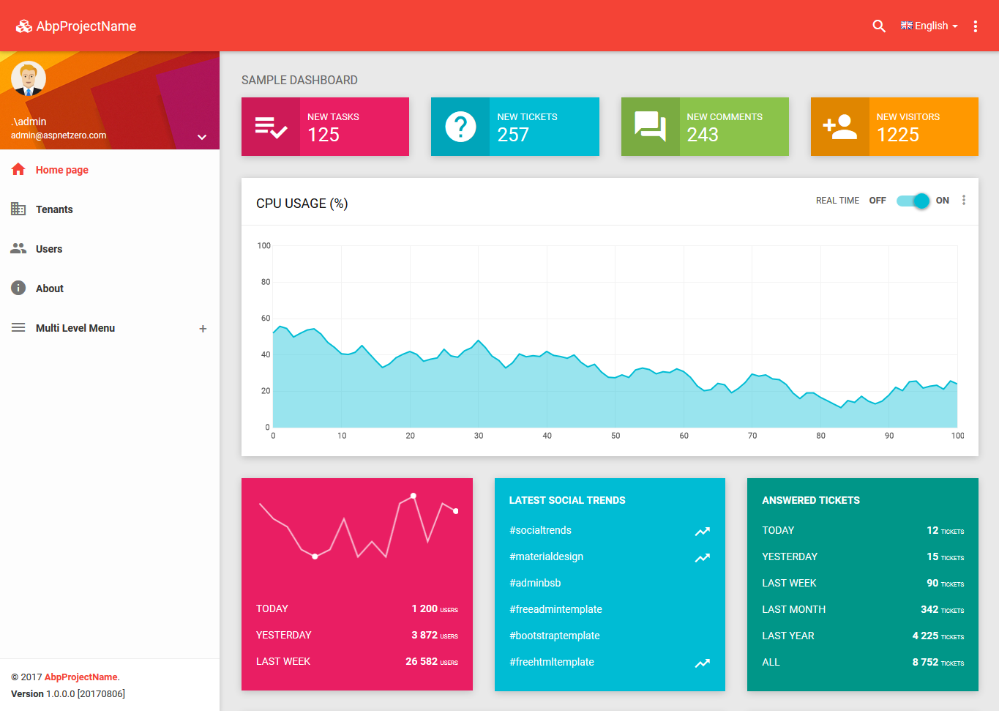
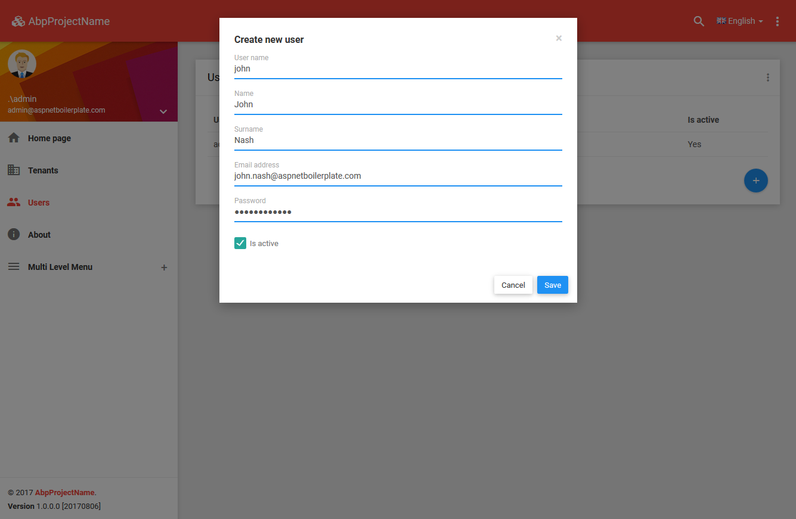
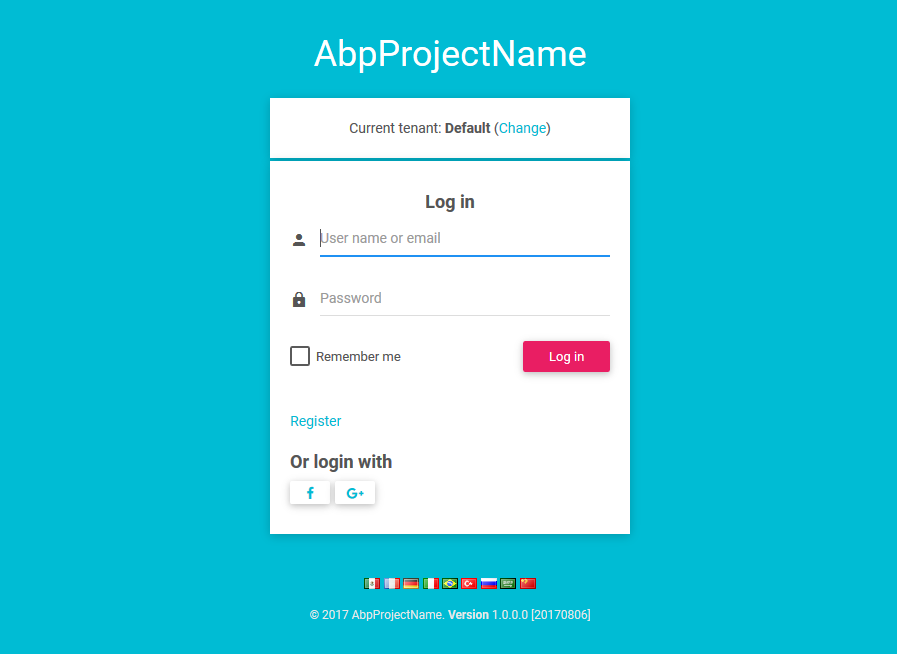

# Introduction

This is a template to create **ASP.NET Core MVC / Angular** based startup projects for [ASP.NET Boilerplate](https://aspnetboilerplate.com/Pages/Documents). It has 2 different versions:

1. [ASP.NET Core MVC & jQuery](https://aspnetboilerplate.com/Pages/Documents/Zero/Startup-Template-Core) (server rendered multi-page application).
2. [ASP.NET Core & Angular](https://aspnetboilerplate.com/Pages/Documents/Zero/Startup-Template-Angular) (single page application).

User Interface is based on [BSB Admin theme](https://github.com/gurayyarar/AdminBSBMaterialDesign).

# Download

Create & download your project from https://aspnetboilerplate.com/Templates

# Screenshots

#### Sample Dashboard Page

#### User Creation Modal

#### Login Page

# Documentation

* [ASP.NET Core MVC & jQuery version.](https://aspnetboilerplate.com/Pages/Documents/Zero/Startup-Template-Core)
* [ASP.NET Core & Angular  version.](https://aspnetboilerplate.com/Pages/Documents/Zero/Startup-Template-Angular)

# License

[MIT](LICENSE).

# 操作步骤

## 创建项目模板.

前往 https://aspnetboilerplate.com/Templates
Target Framework 选择 .NET Core 1.1
Architecture 选择 Multi Page Web Application
保留 Include module zero 的选择
输入项目名称
点击 Create my project! 按钮
等待项目压缩包下载
下载完毕后，使用 Visual Studio 2017 打开项目。

## 项目分析.

项目打开后，有2个目录，分别为 src 与 test
src 目录下， 有7个项目，分别为：
    .Application
	.Core
	.EntityFrameworkCore
	.Migrator
	.Web.Core
	.Web.Host
	.Web.Mvc

test 目录下， 有1个项目，为：
    .Tests

## 测试运行网站.

1. 修改 .Web.Mvc 项目中的 appsettings.json
将 ConnectionStrings 中的 Default 的数据库连接字符串
将 Server=localhost; 修改为 Server=localhost\\SQLEXPRESS;
（因为本机只安装了 SQL Server Express）

2. 在 SQL Server Express 中，创建好一个空白的数据库。
数据库名为 appsettings.json 文件中， 那个 Database= 的名称.

3. 针对 .EntityFrameworkCore 项目，
PM>Update-Database
来生成数据库表与基本数据。

4. 设置 .Web.Mvc 项目为启动项目。
运行。

5. 初始用户名/密码  admin/123qwe
观察运行结果.

## 测试运行 Web Api 服务.

1. 修改 .Web.Host 项目中的 appsettings.json
将 ConnectionStrings 中的 Default 的数据库连接字符串
将 Server=localhost; 修改为 Server=localhost\\SQLEXPRESS;
（因为本机只安装了 SQL Server Express）

2. 设置 .Web.Host 项目为启动项目。
运行。

3. 浏览 swagger 的 Web Api 文档页面。

## 测试增加一个模块.

### .Code 项目.
增加一个 Tasks 的目录，用于存储 任务相关的基础类.

修改 /Authorization/PermissionNames.cs
增加 public const string Pages_Tasks = "Pages.Tasks";

数据库中， 需要执行
INSERT INTO [dbo].[AbpPermissions](
	[CreationTime],[CreatorUserId],[Discriminator],
	[IsGranted],[Name],[TenantId],[RoleId],[UserId]
) VALUES (
	GETDATE(),	NULL,	'RolePermissionSetting',
	1,	'Pages.Tasks',		NULL,  1,  NULL
)
GO

修改 /Authorization/ZeroAuthorizationProvider.cs
增加 context.CreatePermission(PermissionNames.Pages_Tasks, L("Tasks"));

修改 /Localization/SourceFiles/ .xml
根据语种， 增加 <text name="Tasks">Tasks</text>

### .EntityFrameworkCore 项目.
DbContext 类， 增加一行
public DbSet<Task> Tasks { get; set; }

PM>Add-Migration AddTasks
PM>Update-Database

### .Application 项目.
增加一个 Tasks 的目录，用于存储 任务相关的 DTO / 服务接口 / 服务实现.

### .Web.Mvc 项目.
增加 Tasks 控制器.
增加 Tasks 相关视图.
增加 Tasks 相关 js 脚本代码.

PageNames 类中， 增加 Tasks 页面名称.
ZeroNavigationProvider 类中， 增加菜单相关处理.

